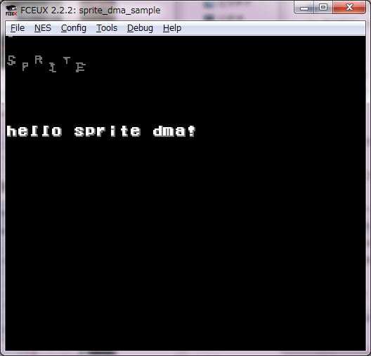

```
L809e:	8d7907	sta	$779
29e7	and	#$e7
8d0120	sta	$2001	PPU Control #2
ae0220	ldx	$2002	PPU Status
a900	lda	#$00
20e68e	jsr	L8ee6
8d0320	sta	$2003	PPU SPRITE RAM Address
a902	lda	#$02
8d1440	sta	$4014	Sprite DMA
```

0x4014 (スプライトDMAレジスタ)

W1 : WRAMからSpriteRAMにデータを転送します。設定したアドレスから0x100バイト分転送します。

位置	内容	値
bit7-0	WRAMベースアドレス	N x 0x100

めも：
　パターンテーブル：0x0000-0x1FFF
　パレットテーブル：0x3F00-0x3F1F

<pre>
PPU
0x2000 (PPU制御レジスタ1)

W1 : PPUの基本設定を行います。

位置	内容	値
bit7	VBlank時にNMI割込を発生	0:オフ, 1:オン
bit6	PPU選択?	0:マスター, 1:スレーブ
bit5	スプライトサイズ	0:8x8ピクセル
1:8x16ピクセル
bit4	BG用キャラクタテーブルベース	0:0x0000, 1:0x1000
bit3	スプライト用キャラクタテーブルベース	0:0x0000, 1:0x1000
bit2	VRAMアクセス時のアドレス増加値	0:1byte, 1:32byte
bit1-0	メインスクリーンアドレス	00:0x2000, 01:0x2400
10:0x2800, 11:0x2C00
</pre>

<pre>
0x4014 (スプライトDMAレジスタ)

W1 : WRAMからSpriteRAMにデータを転送します。設定したアドレスから0x100バイト分転送します。

位置	内容	値
bit7-0	WRAMベースアドレス	N x 0x100
</pre>


<hr>
データ構造
パターンテーブル

パターンテーブルは、表示に使われるキャラクタパターンを保存するテーブルです。通常コンピュータにはROMに「A」「B」「C」等といったフォントデータが入っています。ファミコンの場合は、「絵」としてキャラクタを使うことでグラフィックを表現します。ファミコンの場合キャラクタの単位は、8 x 8 ピクセルで、1ピクセルの情報量が2bitのフォーマットとなっています。

パターンテーブルはVRAM【0x0000-0x1FFF】にマッピングされています。BGやスプライトなど全てのグラフィックは、このキャラクタの組み合わせによって表現されます。キャラクタの持つ情報はルックアップテーブルであり、青や赤と言った最終的な色情報は持っていません。キャラクタにパレットから色を塗る事で最終的に人間が見る「画像」となります。イメージとしてはキャラクタは金型に近いかもしれません。その金型に任意の色を流し込むことで同じ金型でいろんな絵を作り出すことが可能です。ファミコンゲームでよくある「姿は同じだが色違いのモンスター」等は同じキャラクタエントリを使いまわし、違う色を流し込むことで情報量を節約しているわけです。

ネームテーブルが1バイトで1キャラクタとなっているので、同時に参照できるキャラクタ数は256種類となります。VRAM【0x0000-0x1FFF】にマップされた512個のキャラクタデータはBGに256個、スプライトに256個を割り当てます。VRAM【0x0000-0x0FFF】をBGとして使い、VRAM【0x1000-0x1FFF】をスプライトとして使う、または逆にするというように設定します。BGとスプライトのベースアドレス設定はI/Oポート【0x2000】で設定する事が出来ます。

パレットテーブル

画面に使うパレットの組み合わせを保存するテーブルです。ファミコンのパレットテーブルはVRAM【0x3F00-0x3F1F】にマッピングされています。

ファミコンは52色のパレットを持っていますが、キャラクタに色情報は含まれていないので、表示の段階でパレットテーブルで定義された色を塗ることになります。
ファミコンの場合1キャラクタ中に4色塗ることが出来ますので、その色パターンを52色の中から選ぶ事になります。

ファミコン固有の52個の原色のどれを使用するかを4個組み合わせたのがパレット1個の単位となっています。4バイトBG用に4パレット、スプライト用に4パレット定義することが出来ます。つまり計算上は画面中にBGに16色、スプライトに16色を最大同時に表示できることとなりますが、実際にはパレットそれぞれの最初の色VRAM【$3F00, $3F04, $3F08...】については、背景色となり少し扱いが変わりますので実際にはBGは背景色を含めて全部で13色、スプライトは背景色が透明色となるので12色となります。

ネームテーブル

ネームテーブル、どのブロック位置にどのキャラクタを配置するかを指定します。例えばVRAM【0x2043】へデータ0x24が入っていた場合は、画面1の左上から見たブロック座標(3, 2)へ0x24番のキャラクタが埋め込まれます。

属性テーブル

属性テーブルと言うのは、表示するキャラクタへ様々な装飾を行うためのテーブルで、ファミコンの場合はキャラクタに着色するためのテーブルとなります。ファミコンの属性テーブルは、隣接した4個のキャラクタ毎に属性を設定しますので、1バイトに対して16ブロック分の色情報を持っている事になります。その1バイト中に対応するビットレイアウトとブロックの関係は次のようになります。ちなみに下図のセルはキャラクタの単位となっています。
